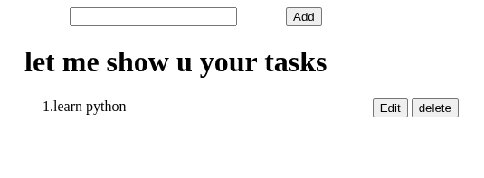

# Todo List App

A simple todo list web application built using HTML, CSS, and JavaScript.

## Features

- Add tasks
- Edit tasks
- Delete tasks

## Demo Screenshot

### Adding Task

### Editing a Task

### Deleting a Task

## How to Run

1. Clone the repository or download the ZIP.
2. Open `index.html` in a browser.

## Author

Daniel Molla
